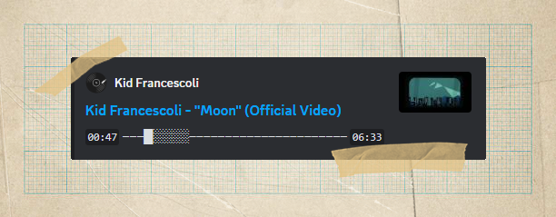
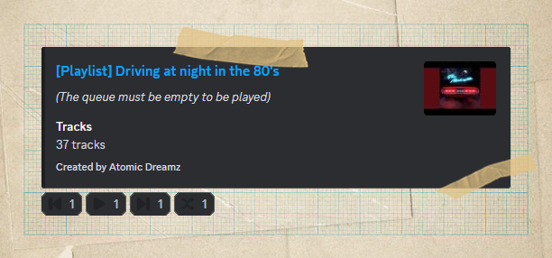
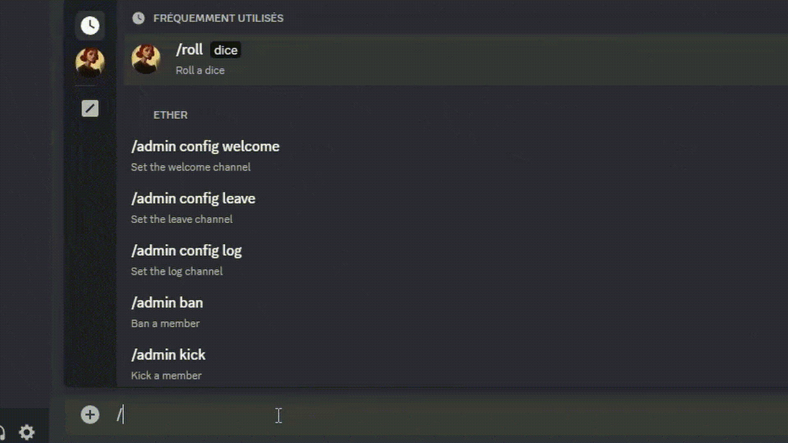

   <h1>Æther Bot</h1>

   
   
   
    
   
   
   
   

# Overview

*The Bot is in development but you can already [use it](https://discord.com/api/oauth2/authorize?client_id=985100792270819389&permissions=1514461785206&scope=bot%20applications.commands)!*

Æther is a powerful and easy to use Discord bot written in python.
The bot include features like **Moderation, Fun, Leveling, Music, Playlists, Reddit, Reactions, Image, DnD, Steam** and more!

You can contribute to the development of the bot by suggesting ideas or reporting bugs by creating an issue or by making changes yourself.  
You can also support the development and hosting of the bot by making a small donation on the platform of your choice:

  

# Features

First, look at this gorgeous music player! 

And now, let me talk about **Playlists**, the coolest feature of Æther! 
You can setup a playlist on your server using the `/music playlist <playlist link>` command.  
And react later to the bot message at any time to play the playlist in one click.

And It's how this look:  

   
Click here to a demo

   

Æther has many other non-music feature such as **birthday reminder**, **memes maker**, **DnD helper**, **admin stuff**, **quiet level system** and a tone of other things to play with.

If you have any ideas you want the bot to have, feel free to join the [support server](https://discord.gg/YTWUCufwjY) and publish your request or post your idea on [GitHub](https://github.com/Ether-DiscordBot/Ether-Bot/discussions).

# Hosting

You can host Æther simply by using Python, a virtual environment or Docker Compose. The environment variables must be in a `.env` file or in the `.secrets.toml` and `config.toml` files

But be aware that Æther is not meant to be hosted by anyone, you may have to change some parts of the code.

# License

Released under [GNU GPL v3](https://www.gnu.org/licenses/gpl-3.0.en.html) license.

Time spent on Æther (it's a lot more): 

